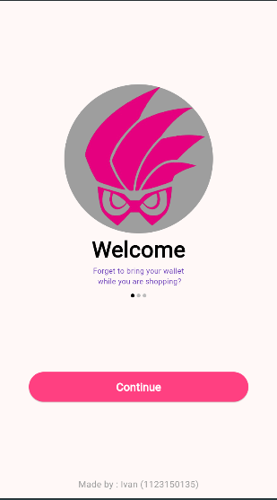
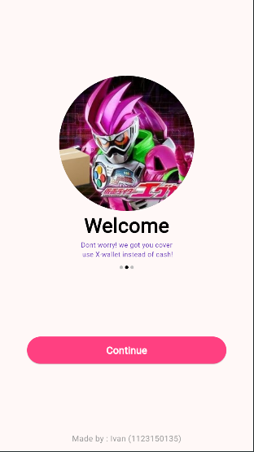
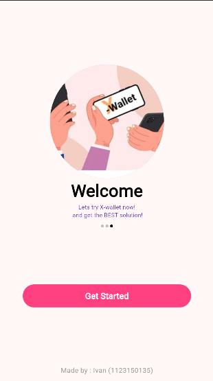
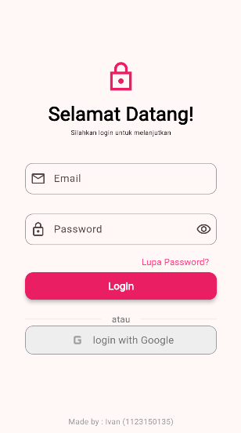

# uts_1123150135_ivan

A new Flutter project.

## Getting Started

**NIM:** 1123150135  
**Nama:** Ivan Darma Saputra  
**Kelas:** TI-SE-23M

---

## Dokumentasi

Berikut tampilan Splashscreen1:

---

Berikut tampilan Splashscreen2:

---

Berikut tampilan Splashscreen3:

---

Berikut tampilan login page:

---

This project is a starting point for a Flutter application.

A few resources to get you started if this is your first Flutter project:

- [Lab: Write your first Flutter app](https://docs.flutter.dev/get-started/codelab)
- [Cookbook: Useful Flutter samples](https://docs.flutter.dev/cookbook)

For help getting started with Flutter development, view the
[online documentation](https://docs.flutter.dev/), which offers tutorials,
samples, guidance on mobile development, and a full API reference.
